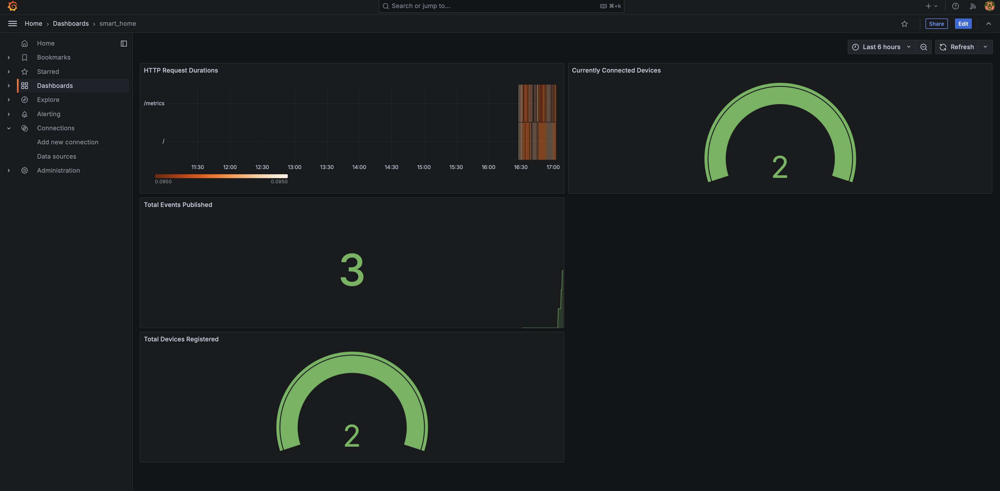
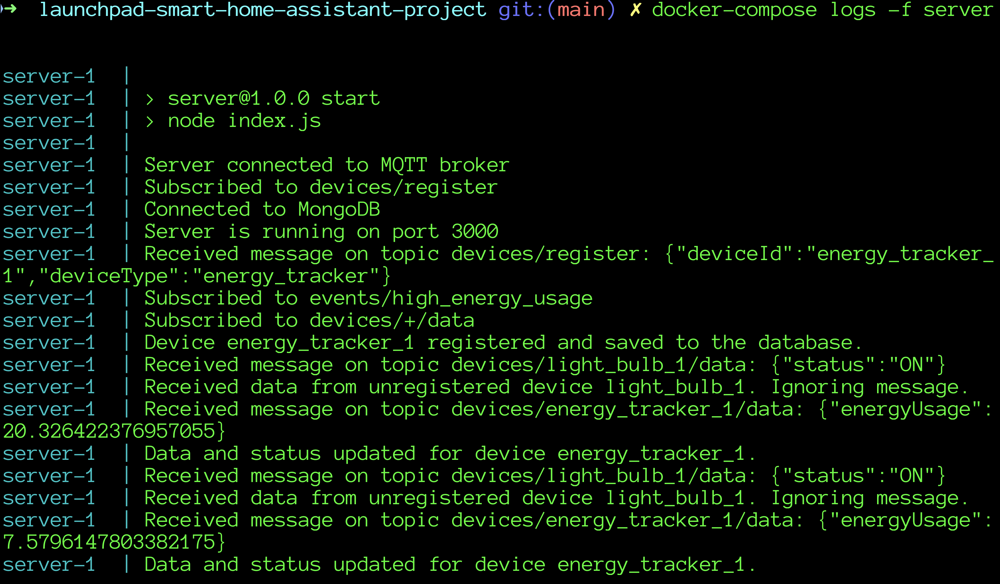
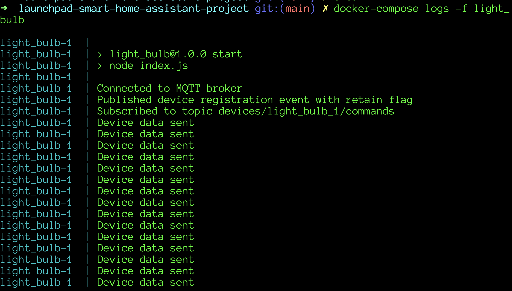
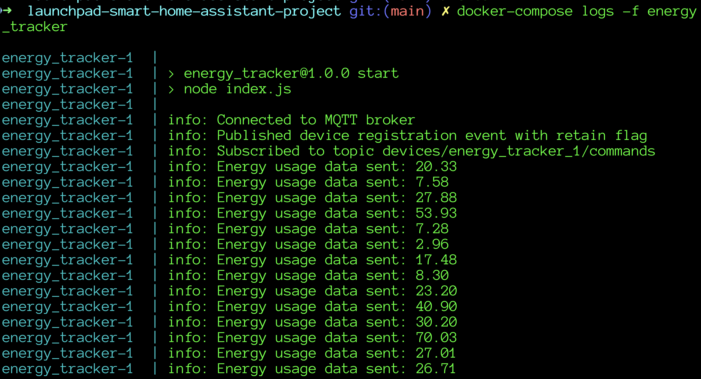

# Smart Home Assistant

## 📚 **Project Overview**

The **Smart Home Assistant** is an event-driven IoT platform designed to monitor and control various smart devices within a home environment. Utilising an Event Bus architecture, the system allows seamless interaction between devices, enabling automated actions based on user-defined events and thresholds.

## 🎯 **Key Features (MVP)**

1. **Event Bus Integration:**
   - Utilises **Mosquitto MQTT Broker** as the Event Bus for publishing and subscribing to events.
   
2. **Device Management:**
   - **HTTP Server:** Built with **Node.js** and **Express.js** to handle device registration, status updates, and command dispatching.
   - **Database:** **MongoDB** stores information about connected devices and their current states.

3. **External Components:**
   - **Energy Tracker:** Monitors energy consumption and publishes events when thresholds are exceeded.
   - **Light Bulb:** Subscribes to energy events and turns off automatically to conserve energy.

4. **Automated Testing:**
   - Comprehensive **tests** ensure code reliability and functionality.

5. **Monitoring & Observability:**
   - **Prometheus:** Collects and stores metrics.
   - **Grafana:** Visualises metrics for system monitoring and auditing.

## 🛠️ **Technologies Used**

- **Backend:**
  - **Node.js** with **Express.js**
  - **MongoDB** for data storage
  - **Mosquitto** as the MQTT broker
  - **Prometheus** for metrics scraping
  - **Grafana** for metrics visualization

- **DevOps:**
  - **Docker** for containerization
  - **Docker Compose** for orchestration

## 🚀 Getting Started

### 📦 Prerequisites

- **Docker** and **Docker Compose** installed on your machine.
- **Node.js** and **npm** installed for development and testing.

### 🛠️ Installation

#### Using Docker Compose

1. **Clone the Repository:**

   ```bash

   git clone https://github.com/AyubAhmed0/launchpad-smart-home-assistant-project.git
   cd launchpad_smart-home-assistant

   ```
2. **Build and Run Services with Docker Compose:**

   ```bash

   docker-compose up --build -d

   ```
3. **Verify Services are Running:**

   ```bash

   docker-compose ps

   ```
Ensure all services are listed as Up.

4. **View logs for Server and the two external devices:**
   
   ```bash

   docker-compose logs -f server
   
   docker-compose logs -f light_bulb
   
   docker-compose logs -f energy_tracker

   ```
You should see the two devices communicating through the event bus.


## 🔍 Accessing the Services

- **HTTP Server:** [http://localhost:3001](http://localhost:3001)
- **Prometheus UI:** [http://localhost:9090](http://localhost:9090)
- **Grafana Dashboard:** [http://localhost:3002](http://localhost:3002)
  - **Login Credentials:** `admin` / `admin` (change on first login)


## 📈 Monitoring

- **Prometheus:** Scrapes metrics from the server and other components.
- **Grafana:** Visualises these metrics through predefined dashboards.
  - **Access Dashboard:** [Grafana Dashboard](http://localhost:3002)
  - **Login Credentials:** `admin` / `admin` (change on first login)
- **Custom Metrics:**
  - Total devices registered
  - Currently connected devices
  - Total events published

## 🧪 Running Tests

1. **Navigate to the Server Directory:**

   ```bash

   cd server

   ```
2. **Install Dependencies:**

   ```bash

   npm install

   ```
3. **Run Tests:**

   ```bash

   npm test

   ```
This command executes all automated tests.

## 📑 **API Endpoints**

The **Smart Home Assistant** provides a set of RESTful API endpoints to manage devices and handle events within the system. Below is a detailed overview of each endpoint, including usage examples with `curl`.

### 🔌 **Device Management**

#### 1. **Register a New Device**

- **Endpoint:** `/devices/register`
- **Method:** `POST`
- **Description:** Registers a new IoT device with the system. Each device must have a unique `deviceId` and a valid `deviceType`.
- **Request Headers:**
  - `Content-Type: application/json`
- **Request Body:**

  ```json
  {
    "deviceId": "test_device_10",
    "deviceType": "security_camera"
  }

  ```
- **Response:**
  
  **Success (201 Created):**
  
  ```json
  {
    "message": "Device registered successfully."
  }

  ```
  
- **Example curl Command:**
  
  ```bash

  curl -X POST http://localhost:3001/devices/register \
    -H 'Content-Type: application/json' \
    -d '{"deviceId": "test_device_10", "deviceType": "security_camera"}'

    ```
- **Expected Response:**
  
  ```json
    {"message":"Device registered successfully."}
    
  ```

#### 2. **Get Device Data**

- **Endpoint:** `/devices/{deviceId}/data`
- **Method:** `GET`
- **Description:** Retrieves the data associated with a specific device.
- **Path Parameters:**
  - `deviceId` (string, required): The unique identifier of the device.
- **Example curl Command:**
  
  ```bash

  curl http://localhost:3001/devices/test_device_10/data

  ```

- **Expected Response:**
  
  ```json
  {
    "data": {
      "status": "OFF"
    }
  }

  ```
#### 3. **Send Command to Device**

- **Endpoint:** `/devices/{deviceId}/commands`
- **Method:** `POST`
- **Description:** Sends a command to a specific device to perform an action (e.g., turning off a light bulb).
- **Path Parameters:**
  - `deviceId` (string, required): The unique identifier of the device.
  - **Request Headers:**
  - `Content-Type: application/json`
- **Request Body:**

  ```json
  {
    "command": "turn_off"
  }

  ```
- **Response:**
  
  **Success (200 OK):**
  
  ```json
  {
    "message": "Command 'turn_off' sent to device test_device_10."
  }

  ```
- **Example curl Command:**
  
  ```bash

  curl -X POST http://localhost:3001/devices/test_device_10/commands \
    -H 'Content-Type: application/json' \
    -d '{"command": "turn_on"}'

  ```

- **Expected Response:**
  
  ```json
  {
    "message": "Command 'turn_off' sent to device test_device_10. Status updated to 'active'."
  }
  ```
 
### 📡 **Event Management**

#### 1. **Publish an Event**

- **Endpoint:** `/events/publish`
- **Method:** `POST`
- **Description:** Publishes an event to a specified topic on the Event Bus, notifying all subscribers of the event.
- **Request Headers:**
  - `Content-Type: application/json`
- **Request Body:**

  ```json
  {
    "topic": "devices/test_device_10/data",
    "message": {
        "status": "ON"
    }
  }

  ```
- **Response:**
  
  **Success (200 OK):**
  
  ```json
  {
    "message": "Event published successfully."
  }
  
  ```
- **Example curl Command:**
  
  ```bash

  curl -X POST http://localhost:3001/events/publish \
    -H 'Content-Type: application/json' \
    -d '{"topic": "devices/test_device_10/data", "message": {"status": "ON"}}'

  ```
- **Expected Response:**
  
  ```json
  {
    "message": "Event published successfully."
  }

  ```

#### 2. **Subscribe to Events**

- **Endpoint:** `/events/subscribe`
- **Method:** `GET`
- **Description:** Subscribes to specified MQTT topics to receive real-time event notifications via Server-Sent Events (SSE).
- **Query Parameters:**
  - `topics` (string, required): A comma-separated list of MQTT topics to subscribe to.
- **Example curl Command:**
  
  ```bash

  curl -N http://localhost:3001/events/subscribe?topics=devices/test_device_10/data

  ```
- **Testing the Subscription:**

Open another terminal window and publish an event to test_device_10

- **Example curl Command:**
  
  ```bash

  curl -X POST http://localhost:3001/events/publish \
    -H 'Content-Type: application/json' \
    -d '{"topic": "devices/test_device_10/data", "message": {"status": "OFF"}}'

  ```
- **Expected Response:**

  ```json
    data: {"topic":"devices/test_device_10/data","message":"{\"status\":\"OFF\"}"}
  ```

### 🌐 **Health Check**

#### 1. **Server Health Check**

- **Endpoint:** `/`
- **Method:** `GET`
- **Description:** Checks if the server is running and responsive.
- **Example curl Command:**
  
  ```bash

  curl http://localhost:3001/

  ```

- **Expected Response:**
  
  ```json
  {
    Server is running
  }
  ```

## 📸 Screenshots






logs for Server and the two external devices
